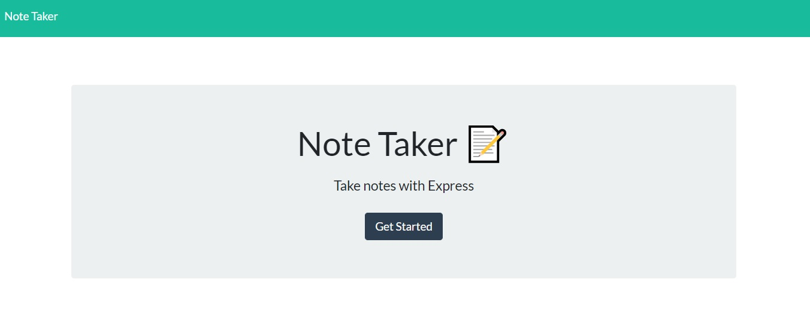

# Note-Taker Application

## Description
Welcome to the express.js note taker application! This node CLI app can be used to write, save and delete your notes.
As a coder it has been very hectic to write notes and keep them organized! This application will allow you to save notes to a server and access them at any time!

# Usage
Use this application for a quick and easy way to write notes, organize notes and access them quickly!

# Preview

Built With
Microsoft Visual Studio Code

# Authors/Contributors
Christopher Sipe - UW Coding Bootcamp Student